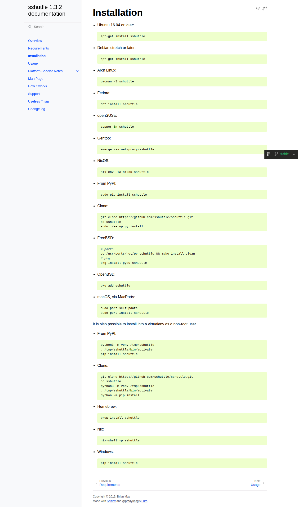

# Visited: https://sshuttle.readthedocs.io/en/stable/installation.html
**Time:** Thu May  7 10:58:20 UTC 2026

## Screenshot

## Raw HTML
[page.html](./page.html)

## Downloaded Media (0 files)
_No media files downloaded_

## Other Links
- [#](#)
- [#furo-main-content](#furo-main-content)
- [#installation](#installation)
- [#svg-arrow-right](#svg-arrow-right)
- [#svg-eye](#svg-eye)
- [#svg-menu](#svg-menu)
- [#svg-moon](#svg-moon)
- [#svg-moon-with-sun](#svg-moon-with-sun)
- [#svg-sun](#svg-sun)
- [#svg-sun-with-moon](#svg-sun-with-moon)
- [#svg-toc](#svg-toc)
- [/_/static/javascript/readthedocs-addons.js](/_/static/javascript/readthedocs-addons.js)
- [_sources/installation.rst.txt](_sources/installation.rst.txt)
- [_static/doctools.js?v=9bcbadda](_static/doctools.js?v=9bcbadda)
- [_static/documentation_options.js?v=8ca9e7a0](_static/documentation_options.js?v=8ca9e7a0)
- [_static/pygments.css?v=03e43079](_static/pygments.css?v=03e43079)
- [_static/scripts/furo.js?v=46bd48cc](_static/scripts/furo.js?v=46bd48cc)
- [_static/sphinx_highlight.js?v=dc90522c](_static/sphinx_highlight.js?v=dc90522c)
- [_static/styles/furo-extensions.css?v=8dab3a3b](_static/styles/furo-extensions.css?v=8dab3a3b)
- [_static/styles/furo.css?v=25af2a20](_static/styles/furo.css?v=25af2a20)
- [changes.html](changes.html)
- [chromeos.html](chromeos.html)
- [genindex.html](genindex.html)
- [how-it-works.html](how-it-works.html)
- [https://github.com/pradyunsg/furo](https://github.com/pradyunsg/furo)
- [https://pradyunsg.me](https://pradyunsg.me)
- [https://www.sphinx-doc.org/](https://www.sphinx-doc.org/)
- [index.html](index.html)
- [manpage.html](manpage.html)
- [openwrt.html](openwrt.html)
- [overview.html](overview.html)
- [platform.html](platform.html)
- [requirements.html](requirements.html)
- [search.html](search.html)
- [support.html](support.html)
- [tproxy.html](tproxy.html)
- [trivia.html](trivia.html)
- [usage.html](usage.html)
- [windows.html](windows.html)

## Stats
- Links: 39
- Media: 0
